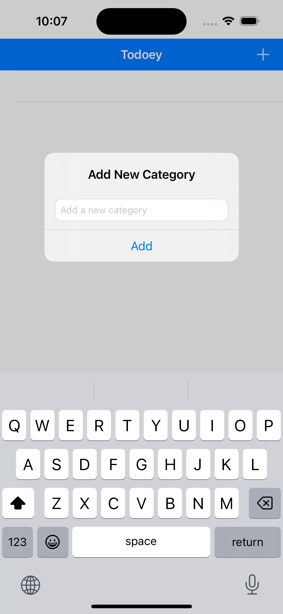
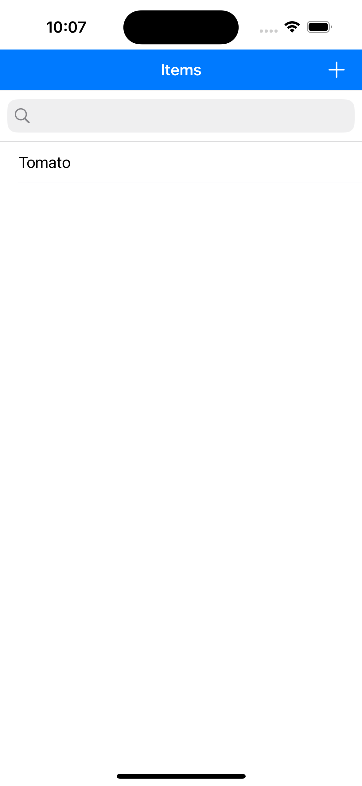
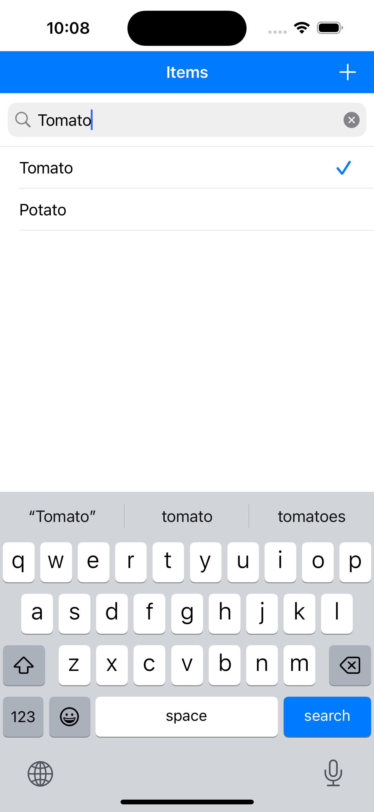

The Todoey App is a simple yet functional to-do list application built using Swift’s UIKit. It helps users manage tasks efficiently by adding, deleting, and marking tasks as complete.

Key Features of Todoey App:
Task Management: Add, delete, and organize tasks.
UIKit Interface: Uses components like UITableView to display tasks in a list.
Task Completion: Tap to mark tasks as complete or incomplete.
Persistent Data Storage: Stores tasks using UserDefaults, CoreData, or Realm to keep them across app sessions.
Interactive UI: Clean and intuitive interface with smooth animations and transitions.
Theming (Optional): Allows light or dark mode based on user preference.
Use Cases:
Personal Task Management: Keep track of daily to-do lists.
Productivity: Manage projects and deadlines.
Learning Project: An excellent way to practice UIKit with data persistence in Swift.
In summary, Todoey is a lightweight, user-friendly to-do list app built using Swift’s UIKit, making it a great project for managing tasks and for developers learning iOS development with UIKit.

  
